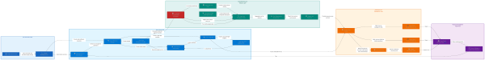

# 💰 Automated Azure Budget Guardrail System

This project provides an automated cost-monitoring and notification system for Azure. When a budget threshold is exceeded, it automatically identifies the highest-cost resource and sends a detailed email notification, including a direct link to manage the resource in the Azure Portal.

The system integrates Azure Cost Management, Budgets, Monitor Action Groups, Logic Apps, Managed Identity, and RBAC to create a powerful, event-driven cost guardrail.

## How It Works

The automated workflow is triggered when your spending surpasses a predefined budget threshold.

```
Azure Budget
     │
     └── Threshold exceeded
         ▼
Azure Monitor Action Group
     │
     └── Triggers HTTP Webhook
         ▼
Azure Logic App
     │
     └── Queries Cost Management API
         ▼
Azure Cost Management
     │
     └── Aggregates & ranks resources
         ▼
Identifies Highest-Cost Resource
     │
     ▼
Sends Email Notification
     ├── Budget & Cost Information
     ├── Highest-Cost Resource ID
     └── Direct Azure Portal Link
```

When the budget threshold is met, the Azure Monitor Action Group invokes the Logic App via an HTTP webhook. The Logic App then securely queries Azure Cost Management data, identifies the resource that has accrued the most cost, and sends an email with actionable details to the designated recipient.

## Features

-   **Automated Budget Creation**: Interactively create a subscription-level budget via a guided script.
-   **Event-Driven Workflow**: The entire process is triggered automatically by an Azure Budget alert, requiring no manual intervention.
-   **Dynamic Cost Analysis**: The Logic App queries the Cost Management API in real-time to find the most expensive resource for the current billing period.
-   **Secure by Design**: Uses a System-Assigned Managed Identity for the Logic App, eliminating the need to store credentials or secrets. The required permissions are granted via Azure RBAC following the principle of least privilege.
-   **Actionable Notifications**: Emails contain not just an alert, but the specific resource ID and a direct link to the Azure Portal, enabling administrators to investigate and take action immediately.
-   **Script-Driven Deployment**: A master Python script orchestrates the entire deployment, running a series of shell scripts to provision and configure all necessary Azure resources in the correct order.

## Prerequisites

Before you begin, ensure you have the following installed and configured:

-   An active **Azure subscription**.
-   **Python 3**: Used to run the main deployment orchestrator.
-   Permissions to create resources (Budgets, Action Groups, Logic Apps) and assign RBAC roles (Cost Management Reader) at the subscription scope.

## Deployment

The entire infrastructure can be deployed by running a single Python script. This script automates the execution of all necessary shell scripts in the correct sequence, prompting you for required inputs along the way.

1.  **Clone the repository:**
    ```sh
    git clone https://github.com/subhan115/automated_budget_project.git
    cd automated_budget_project
    ```

2.  **Run the main deployment script:**
    ```sh
    python main.py
    ```

The script will guide you through the following steps:
-   Creating an Azure Budget for your subscription.
-   Creating an Azure Monitor Action Group.
-   Setting a notification threshold to link the Budget to the Action Group.
-   Deploying the Logic App from an ARM template.
-   Linking the Action Group to the Logic App's webhook.
-   Assigning the necessary RBAC permissions for the Logic App to read cost data.

## 🏗️ Architecture



## The Automation Workflow Explained

The `main.py` script orchestrates the following shell scripts to build the system:

1.  **`budget.sh`**:
    -   Confirms you are logged into the Azure CLI.
    -   Prompts you to enter a budget amount, name, and time period.
    -   Creates a subscription-level budget using the Azure REST API.
    -   Saves metadata like the Budget Name and Subscription ID to a `.env` file for use by subsequent scripts.

2.  **`action_group.sh`**:
    -   Prompts you to select or create a Resource Group for the Action Group.
    -   Prompts for an Action Group name.
    -   Creates the Azure Monitor Action Group and saves its resource ID to the `.env` file.

3.  **`notification.sh`**:
    -   Prompts for a threshold percentage (e.g., `80`).
    -   Retrieves the budget definition created by `budget.sh`.
    -   Injects a notification block into the budget's properties, configuring it to trigger the Action Group when spending reaches the specified threshold.

4.  **`deploy_LogicApp.sh`**:
    -   Prompts for the Resource Group and recipient email for notifications.
    -   Deploys the `azuredeploy.json` ARM template, which provisions:
        -   The Logic App workflow with a System-Assigned Managed Identity.
        -   An API connection to Office 365 Outlook.

5.  **`Logic_App_URL.sh`**:
    -   Retrieves the unique HTTP trigger URL from the newly deployed Logic App.
    -   Updates the Action Group to use this URL as its webhook receiver, linking the budget alert mechanism to the automation workflow.

6.  **`RBAC.sh`**:
    -   Enables a System-Assigned Managed Identity on the Logic App if not already enabled.
    -   Retrieves the Principal ID of the Managed Identity.
    -   Assigns the **"Cost Management Reader"** role to this identity at the subscription scope, granting it the necessary permissions to query cost data securely.

## 📧 Logic App Email Account Setup

After running the project and deploying the architecture to your Azure environment, you need to connect an account to the Logic App's email connector.

1. Go to [**Azure Portal**](https://portal.azure.com) and sign in if you haven't already.
2. Open the **Resource Group** where the Logic App is deployed.
3. Open the **Logic App**.
4. Find the **Send an email (V2)** action in the workflow.
5. Click on **Send an email (V2)**.
6. A configuration menu will appear on the **right-hand side**.
7. Scroll to the bottom of the menu and click the **`+ Add an account`** button.
8. Sign in or create an outlook account that you want the Logic App to use for sending emails.
9. Once the account is connected, the **Send an email (V2)** action will be ready to send email notifications.

> **⚠️ Important:** This account connection is required for the email notification functionality to work correctly after deployment.

## Security

Security is a primary consideration in this project's design.

-   **Managed Identity**: The Logic App authenticates to the Azure Resource Manager API using its own identity. This avoids storing any keys, secrets, or service principals within the Logic App's definition.
-   **Least-Privilege RBAC**: The Logic App's identity is granted only the **Cost Management Reader** role, which provides read-only access to cost and billing data. It has no permissions to modify resources or access other data.

## Project Goal

The primary goal of this project is to make Azure budget alerts more actionable. Instead of a generic alert like:

> "Your Azure budget was exceeded."

This system provides a specific, actionable answer to the question:

> "The budget was exceeded. **Which resource** is costing the most, and **where can I manage it?**"

This helps administrators reduce the time between alert and resolution, enabling better cost control.

## Disclaimer

This project is intended for educational and experimental purposes. Before using a similar architecture in a production environment, always review the RBAC permissions, budget configurations, and Logic App workflows to ensure they meet your organization's security and operational standards.
